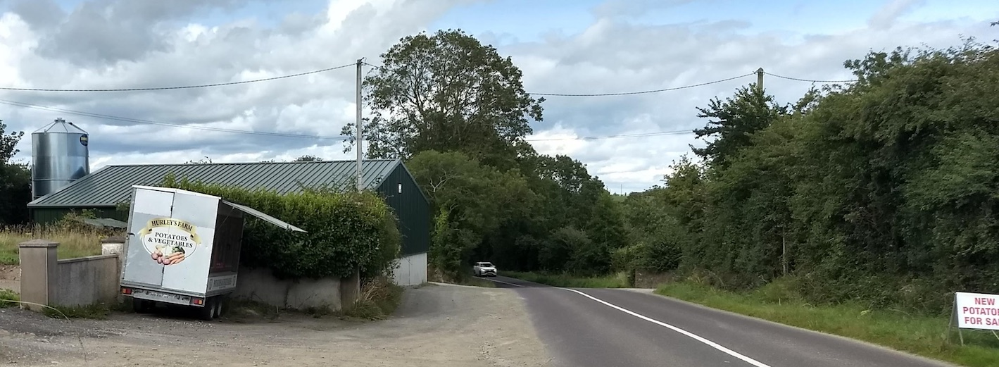

## Get ready for the wedding of Rachel O'Brien and Gary O'Sullivan!

On August 14th, in the [Kinsale Hotel & Spa](https://www.kinsalehotelandspa.ie/) and [Robin Rise](https://goo.gl/maps/pEDN199CXB1QTMfu9), Rachel and Gary will tie the knot, and celebrate with their friends and family.

[Add to Google Calendar](http://www.google.com/calendar/event?action=TEMPLATE&text=Rachel%20%26%20Gary's%20Wedding&dates=20200814T140000/20200815T020000&details=We're%20looking%20forward%20to%20having%20your%20celebrate%20our%20special%20day%20with%20us!%20Please%20go%20to%20rachelandgary.com%20for%20up%20to%20date%20details%20on%20attending%20the%20wedding&location=https%3A%2F%2Fwww.kinsalehotelandspa.ie%2F)

### What's Happening on the Day?

- Arrive to [Kinsale Hotel & Spa](https://g.page/hotelkinsale?share) by 1.30pm
- Ceremony begins at 2pm. It will take place outside if weather permits.
- The ceremony will be followed by a short drinks reception at the hotel
- The party moves to [Robin Rise](https://goo.gl/maps/fT21DcQ49QYxPvdQ9) at 4pm, where there will be a drinks reception, food and full bar. The mobile bar company on site accept card or cash.
- A DJ will perform later in the evening, and a taxi will be on call for the night to take you to wherever you are going around Kinsale.
- There will be staff on site to help you with anything you need, including organising taxis.

### What About Parking?

In classic Irish style, if you've arrived at Robin Rise, you've gone too far, turn back! Parking will be about 100 metres away on the same side of the road in the direction of Kinsale, with thanks to John Barry for the loan of the field.

Coming from Kinsale, the entrance to the parking field is shortly after passing Noel Hurley's famous potato truck on your left side (see photo below) so slow down when you see the potato truck and the entrance is on your left after you go around that corner. Of course if you would like to drop people off at the house you can, but there will be no parking at the house itself.

### What Should I Wear?

Clothes are preferable, given the unpredictability of Irish weather. We'll all be wearing normal wedding attire. It would be a good idea for guests to bring a warm top/jacket to Robin Rise in the event that it gets cold later in the evening, but we hope to have plenty of outdoor heating to avoid this necessity.

### Getting There

The wedding will take place at two locations. The ceremony will take place at the [Kinsale Hotel & Spa](https://www.kinsalehotelandspa.ie/) at 2pm. Parking is available at the venue.

The party will take place at [Robin Rise, Knocknahilan](https://goo.gl/maps/pEDN199CXB1QTMfu9), the ancestral home of the O'Sullivan clan.

### Getting Away

We have organised a taxi to do shuttle runs from the house to Kinsale and surrounding areas that should cover getting most of you home to your beds. This taxi will run from 1am to 4am and will be free for you.

### What's Happening The Day After?

We'll probably go for a late lunch in Kinsale and you'll all be welcome to join us if you can. We will then resurrect the party at Robin Rise for Saturday evening and you're welcome to join us there from 6pm onwards.

### Watching the Ceremony

For anyone who can't make it to the ceremony, we'll be streaming it live on the World Wide Web. If the Infant of Prague does not do his job and it rains on the day we will be limited to having only family at the ceremony as it would then be moved indoors. We will text all attendees as soon as we know if we have to move indoors.

Further details will appear here closer to the time.

### Social Distancing

In the current climate, we are all concerned with the potential spread of Covid-19. As such, at both the hotel and the party there will be social distancing measures put in place, with all gatherings taking place outdoors. We have marquees and a large open shed in use at Robin Rise, so even if it rains we can still be outdoors and enjoying ourselves. There will be numerous stations for hand washing and sanitising. Please feel free to wear a mask, kilt or anything else you feel is appropriate. All activities will take place outdoors with plenty of space to maintain a friendly distance while still celebrating together.

### Contact

Gary & Rachel are contacting all guests via email or text, so please reply to them if you need anything. The email address is [organisedweddingfun@gmail.com](mailto:organisedweddingfun@gmail.com). Updates on what's happening will appear here on the website, so please check here if you have any questions about recent changes.

Please note that there is very poor mobile phone reception at Robin Rise. If you need to be contacted (for example, by babysitters) by phone while at the party you can be contacted on 021 4772289. Please give this number to people who may need to contact you. The phone will be monitored throughout the day.

You can also use the house phone to call out at any stage. Due to the amount of people attending and the need for Wi-Fi to be used for wedding services we will ask you to only connect to the Wi-Fi when you want to check your messages and then please disconnect so that everybody will be able to use it when needed.
